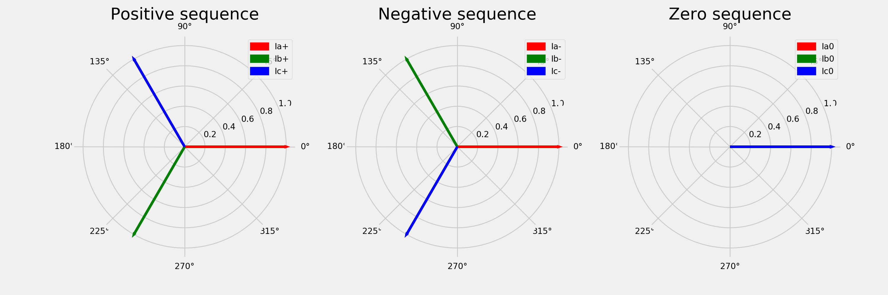
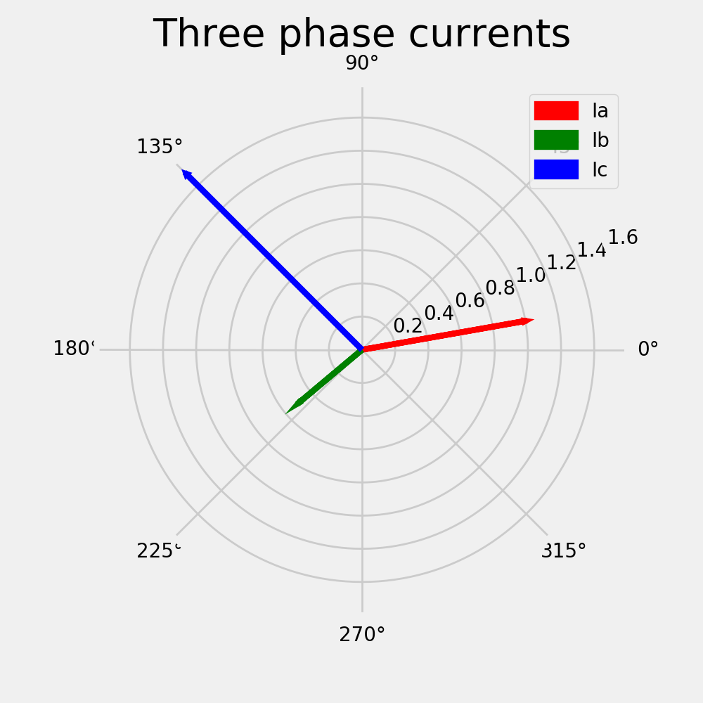
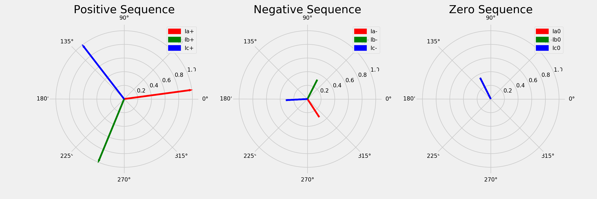
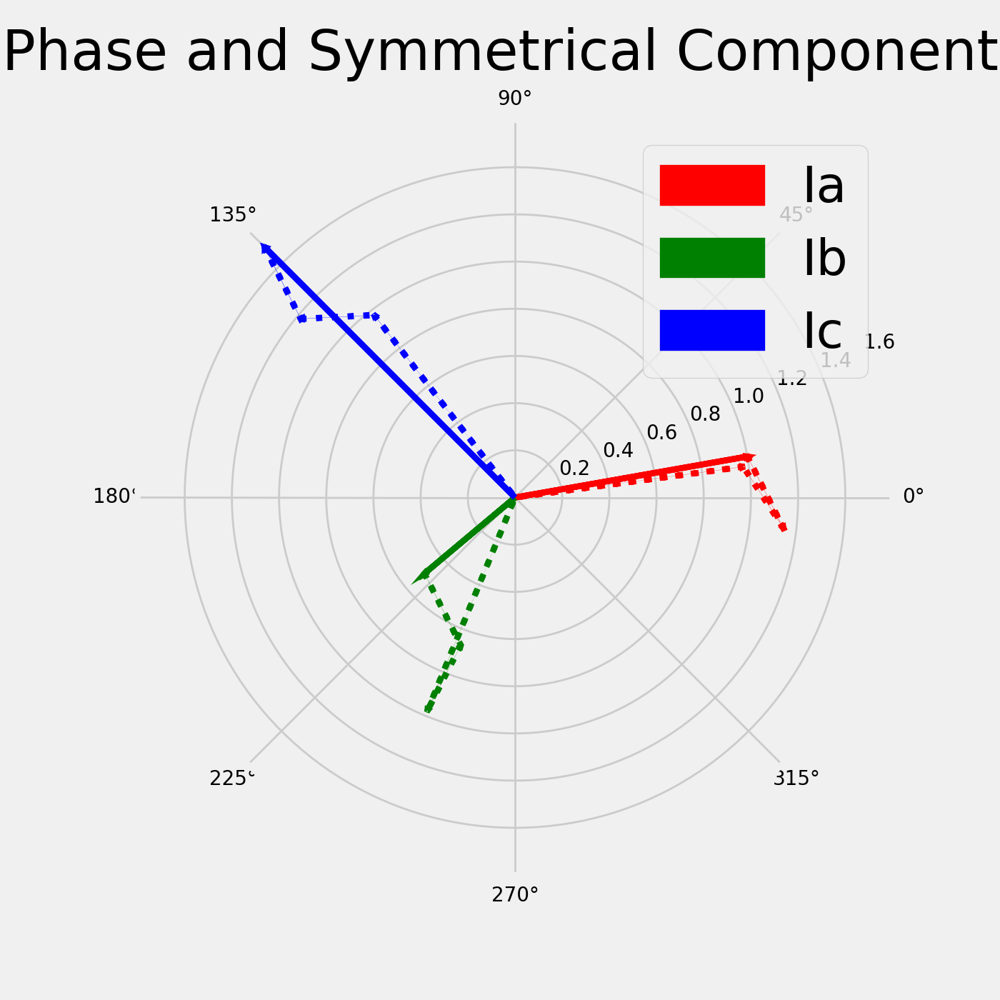
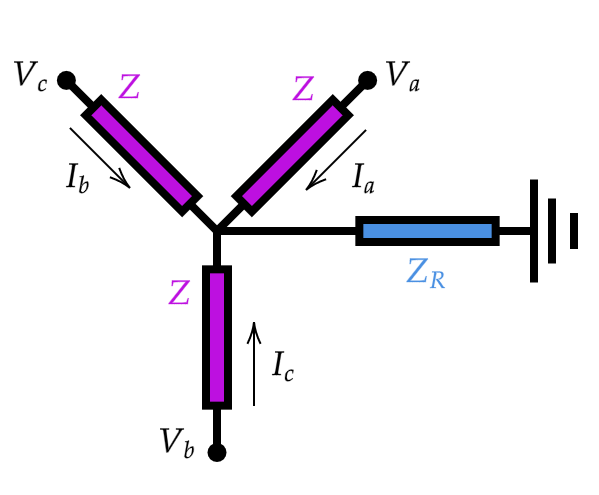
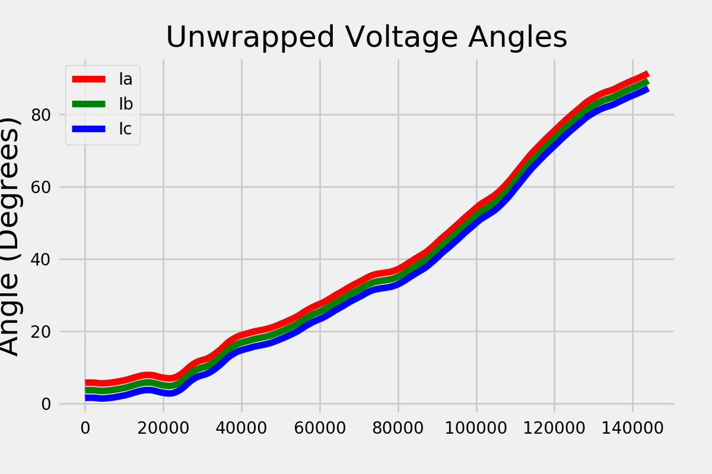

# Symmetrical Components
> Author: Mohini Bariya
>
> November 20, 2020
>
> This post provides an introduction to symmetrical components (i.e., positive, negative and zero sequence vectors) for three-phase circuits.
---

*Symmetrical components* are a popular method for analyzing and discussing three phase circuits. Instead of modeling the system in terms of the three phase voltages/currents---represented by a triplet of phasors---the symmetrical component method models the system in terms of three sets of three phasors, or nine in total. In spite of turning three phasors to nine, the transform is not underdetermined. While the original phasors are unconstrained, the symmetrical components obey strict symmetries. The three symmetrical component sets are called the positive, negative, and zero sequences. In Fig 1, we can see the strict symmetries: within each set, the phasors have equal magnitude, and fixed relative angles. The only flexibility is in scaling and rotating each full set of three phasors.  

Figure 1: The symmetrical components.

Let’s look at an example. Suppose we have the following set of current phasors. These are really unbalanced, and would be bad news for a system operator! They have significantly different magnitudes and are not even close to $120^o$ apart. We visualize them as phasors in Fig. 2 and as time domain signals in Fig. 3 (for more on this conversion, see [this post](https://blog.ni4ai.org/post/2020-07-30-what-is-the-angle/)).

Figure 2: Unbalanced three phase currents

Figure 3: Unbalanced three phase currents

Fig. 4 shows the symmetrical component representation of these unbalanced current phasors. Notice how we’ve obtained three highly symmetric sets of phasors from the totally asymmetric original phasors.

Figure 4: Symmetrical components of unbalanced currents

To return to the original phasors, we simply add up the corresponding phasors in each of the symmetrical component sets. This is visualized in Fig. 5. 

Figure 5: From symmetrical components to phase currents.

The symmetrical component transform and its inverse are expressed mathematically in the following matrix equations [1].

Phase a, b, c to symmetrical components
$$  
\alpha = e^{j\frac{2\pi}{3}}\\  
\begin{bmatrix} I_{0} \\ I_{+} \\ I_{-} \end{bmatrix} = \frac{1}{3}\begin{bmatrix} 1 & 1 & 1\\ 1 & \alpha & \alpha^2 \\ 1 & \alpha^2 & \alpha\end{bmatrix}\begin{bmatrix}I_a \\ I_b \\ I_c\end{bmatrix}  
$$

Symmetrical components to Phase a, b, c
$$  
\begin{bmatrix} I_{a} \\ I_{b} \\ I_{c} \end{bmatrix} = \frac{1}{3}\begin{bmatrix} 1 & 1 & 1\\ 1 & \alpha^2 & \alpha \\ 1 & \alpha & \alpha^2\end{bmatrix}\begin{bmatrix}I_{0} \\ I_{+} \\ I_{-}\end{bmatrix}  
$$

Why do we use symmetrical components? They are useful in both modeling and analysis. Since the positive, negative, and zero sequence components always obey strict symmetries, it is often easier to model the effect of a three phase circuit on each symmetrical component set independently, than on the original unbalanced phasors. Since circuits are linear, we can simply add up the effect on each sequence component to obtain the full effect on the unbalanced phasors. This linearity also means that each sequence current only affects the corresponding sequence voltage, leading to simplified voltage and current relationships in the symmetrical component domain.

Consider the following three phase circuit, which is called a “Y” connection.

Figure 6: Y connected circuit.

In this circuit, the three phase currents meet at a common point and flow through a single wire to ground. Let us write the voltage-current relationship per phase. This gives us the matrix equation:
$$  
\begin{bmatrix}  
V_a \\ V_b \\ V_c  
\end{bmatrix} = \begin{bmatrix}  
Z + Z_R & Z_R & Z_R\\  
Z_R & Z + Z_R & Z_R\\  
Z_R & Z_R & Z + Z_R  
\end{bmatrix}\begin{bmatrix}  
I_a \\ I_b \\ I_c  
\end{bmatrix}  
$$

Now, let’s do the same in terms of symmetrical components. It is easy to see that the positive and negative sequence currents will add to 0 in the return wire, leaving only the zero sequence components to be affected by $Z_R$. Recall, that each voltage symmetrical component depends only on the corresponding symmetrical component of current. This leads to the following equation relating voltage symmetrical components to current symmetrical components:
$$  
\begin{bmatrix}  
V_0 \\ V_+ \\ V_-  
\end{bmatrix} = \begin{bmatrix}  
3Z_R & 0 & 0\\  
0 & Z & 0\\  
0 & 0 & Z  
\end{bmatrix}\begin{bmatrix}  
I_0 \\ I_+ \\ I_-  
\end{bmatrix}  
$$
In analysis, looking at the symmetrical components can more intuitively convey the nature of imbalances caused by system events such as faults. For example, faults involving ground lead to a zero sequence component, while line to line faults produce only positive and negative sequence components [2].

We can compute symmetrical components on real PMU measurements in the NI4AI dataset. This entails querying 6 measurements from a single PMU: three magnitudes and three angles for the phasors from each of the three circuit phases. We will compute the symmetrical components of a set of voltage measurements. The plots in Fig. 7 show the raw voltage magnitudes and angles over 5 minutes.

Figure 7: Three phase voltage measurements

Notice that the angles reported by the PMUs are in degrees and are “wrapped” to bound them between 0 and 360 degrees. For this computation, we “unwrap” them and convert to radians to obtain the smooth angle time series shown in Fig. 8 (for more on this transformation, see [this post](https://blog.ni4ai.org/post/2020-07-29-what-is-the-angle-part-2/)):

Figure 8: Unwrapped voltage angles

The final preprocessing step is to combine the magnitude and angle measurements to obtain complex valued voltage phasors. From these phasors, we compute the symmetrical components. The magnitudes of the positive, negative, and zero sequence components are plotted in Fig. 9.

Figure 9: Magnitude of symmetrical components of voltage data.

Notice that while the negative and zero sequence components are never zero, their magnitudes are several orders of magnitude smaller than the positive sequence. This reflects the fact that while the system is never perfectly balanced, it is close to balanced.

Finally, let us consider what happens to the symmetrical components during a significant system event. First, we query voltage measurements during a large voltage sag, where the voltage magnitude drops briefly but dramatically (for more on voltage sags, see [this post](https://blog.ni4ai.org/post/2020-04-15-voltage-sags/)). The data is shown in Figure 10. 

Figure 10: Voltage measurements during voltage sag event.

The symmetrical component magnitudes during this event are shown in Fig. 11.

Figure 11: Magnitude of symmetrical components of voltage sag.

Notice the dramatic increase in the positive and negative sequence components during the voltage sag. This information may be useful for identifying the cause of the voltage sag.

#### References
[1] Amberg, A., & Rangel, A. (2014). Tutorial on symmetrical components. Selinc. Cachefly. Net, 1, 1-6
[2] https://peguru.com/2011/05/symmetrical-components-demystified/
