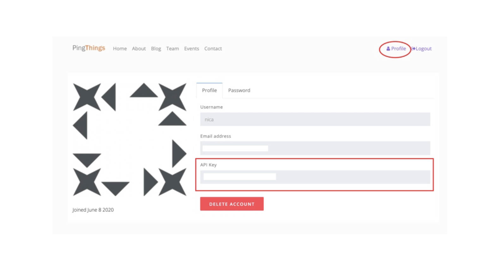

---
# API Demo

In this demo, we'll use the blog post “A brief walkthrough of the Sunshine uPMU dataset" ([here]()) to show you how you can access the API. 

Here, we show you how to run a jupyter notebook using Google Colab. You can also request access to the NI4AI jupyterhub server by sending us an email with your username and brief introduction.

## Using Colab

Colab notebooks run on a virtual machine in the cloud, which means you can run them without having install python or other packages locally.
You'll need a Google account to run colab notebooks in the cloud.

You can access our Colab Notebook [here](https://drive.google.com/file/d/1DAecP25WQKm9K2LDZgu-s1x8ZKKcPloU/view?usp=sharing). Select "Open with Google Colaboratory” and it'll open up a new tab allowing you to run code directly in your browser. You may need to install the Google Colaboratory plugin if you haven't done so already.

Because colab notebooks run on virtual machines, you'll need to install the BTrDB library every time you launch a new notebook server.

## Step 1. Install btrdb
PredictiveGrid uses a Python package called btrdb to manage database queries. You can find the install guide on the [btrdb website](https://btrdb.readthedocs.io/en/latest/installing.html).


## Step 2. Establish a database connection

If you're logged into a PredictiveGrid jupyter server, your API key and username are stored as environment variables. Establishing a connection to the database requires only two lines of code:

```
import btrdb
db = btrdb.connect()
```

If you're working locally, you'll need to explicitly pass your API key and endpoint to the `connect()` function. This lets us know who you are, and where you want to retrieve data from.

## Step 3. Get your API key

Your API key is a randomly generated 24-digit alpha numberic code that lets us know who you are.
This allows us to keep track of how many people are using the API and how often.
It also lets us know what data you do and don't have access to.
You'll get an error if you try to perform operations that exceed your permissions.
If you wish to request additional permissions, feel free to send us an email to issue the request.

You can find your API key by logging in at ni4ai.org. 
It'll be listed under your "Profile" in the top right corner of the screen.

Once you have your key, the syntax for connecting to the database looks like this:

```python 
YOUR_API_KEY = 'your-key-goes-here'
db = btrdb.connect("api.ni4ai.org:4411", apikey=YOUR_API_KEY)
```





## Start analyzing data
Once you have a connection to the database, you'll be able to copy code from any of our blog posts and run it in your jupyter environment.

If you're new to PredictiveGrid, we recommend starting with our new user tutorials. You can find them on the blog [](here), or can type the following command into any terminal window (locally or in jupyterhub) to download the code.

```
git clone https://github.com/PingThingsIO/ni4ai-notebooks.git
```

